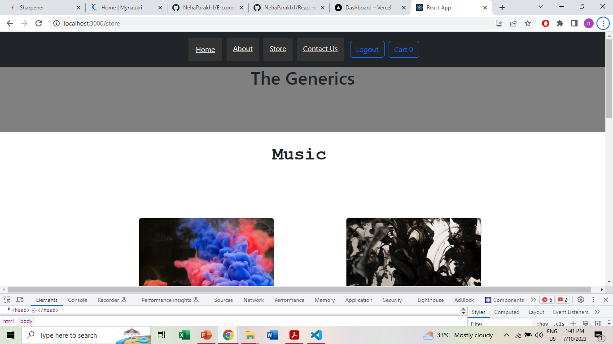

# E-commerce app with React context API

This is an e-commerce application built using React and leveraging the power of React Context API to implement user-specific cart functionality.

# Features

1. Each user has their own personalized shopping cart, allowing them to add, remove, and update items according to their preferences. The cart data is managed using the React Context API, providing a seamless and efficient user experience.
2. The app provides details of available products, including relevant details such as images, descriptions, prices, and ratings.

# Technologies Used

1. React
2. React Context API
3. HTML
4. CSS
5. Javascript
6. Firebase
7. React Router

# Demo

https://e-commerce-project-lovat.vercel.app/login

# Images of the app

